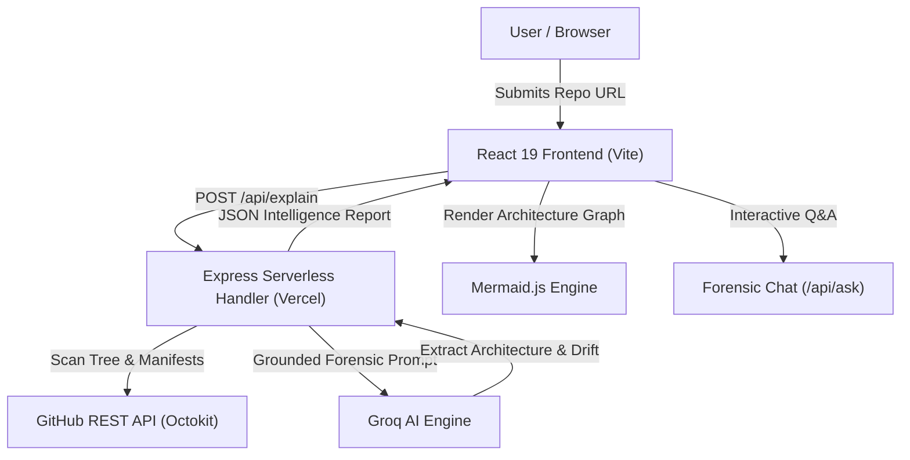

# REPO IQ 🧠🔍
> **Understand any repository without reading it line by line.**  
> Traces architecture, dependencies, and documentation claims back to verifiable evidence found in the actual codebase.

[](https://repo-intelligence-three.vercel.app)
[](https://react.dev/)
[](https://vitejs.dev/)
[](https://nodejs.org/)
[](https://opensource.org/licenses/MIT)

---

## 🌐 Live Application
Try the live production application here:  
👉 **[https://repo-intelligence-three.vercel.app](https://repo-intelligence-three.vercel.app)**

---

## 💡 What is REPO IQ?

Modern codebases are complex, documentation is frequently outdated, and developer onboarding is slow. Traditional AI summarizers hallucinate files and make assumptions based solely on the `README.md`.

**REPO IQ** is a code-grounded forensic inspection engine. It scans file trees, parses package manifests, tracks module relationships, and audits README claims against real source code evidence.

---

## ✨ Key Features

### 1. 🔍 Evidence-Grounded Architectural Profiling
- Scans repository trees and key manifests (`package.json`, `requirements.txt`, `go.mod`, `Cargo.toml`, etc.).
- Categorizes components into frontend, backend, database, services, and tooling.
- Computes real dependencies and import connections directly from source files.

### 2. 📊 Interactive Architecture & Dependency Graphs
- Automatically compiles file relationships into crisp, interactive vector diagrams powered by **Mermaid.js**.
- Toggle between **Evidence-Backed Connections** (direct file-to-file imports) and high-level **Overview Architecture**.
- Built-in syntax sanitization and error suppression for seamless rendering.

### 3. 🩺 README ↔ Code Drift Audit
- Scans `README.md` claims and matches them against discovered code evidence.
- Flags documentation drift, unverified tech claims, or missing features with confidence ratings.
- Categorizes claims into:
  - 🟢 **Verified Evidence**
  - 🟡 **Requires Review**
  - 🔴 **Contradictions / Missing Implementation**

### 4. 💬 Forensic Code Interrogation (Chat with Citations)
- Ask deep architectural questions: *"Where are routes defined?"*, *"How does authentication work?"*, *"Is MongoDB used?"*.
- Dynamic evidence retrieval selects and fetches candidate source files in parallel.
- **Strict Evidence Guardrail:** If an answer cannot be proven from scanned code, it strictly returns:
  ```text
  NOT FOUND IN SCANNED EVIDENCE
  ```
- All responses include line-level citations and proof snippets.

### 5. ⚡ Sub-5-Second High-Throughput Pipeline
- Powered by high-speed Groq inference (`groq/compound-mini` with a 70,000 TPM limit).
- Multi-model fallback redundancy (`openai/gpt-oss-20b`, `qwen/qwen3.8-27b`).
- Parallel file fetching with `Promise.allSettled()` and intelligent tree pruning.

---

## 🏗️ Architecture



---

## 🛠️ Tech Stack

- **Frontend:** React 19, Vite 8, Lucide Icons, Mermaid.js, Glassmorphic CSS Design System
- **Backend:** Node.js (ES Modules), Express 5, Octokit (GitHub REST API), Groq SDK
- **AI Models:** Groq Compound Mini (Primary), GPT-OSS-20B, Qwen 3.8 / 3.6
- **Deployment:** Vercel (Unified Static Hosting + Serverless Functions)

---

## 🚀 Getting Started Locally

### Prerequisites
- Node.js 18+ (Node.js 20 or 24 recommended)
- Git
- A [GitHub Personal Access Token](https://github.com/settings/tokens) (classic or fine-grained with public repo read access)
- A [Groq API Key](https://console.groq.com/)

### 1. Clone the Repository
```bash
git clone https://github.com/fatimasafwa30/repo-intelligence.git
cd repo-intelligence
```

### 2. Configure Environment Variables
Create a `.env` file in the `backend/` directory:
```bash
# backend/.env
PORT=5000
GITHUB_TOKEN=your_github_token_here
GROQ_API_KEY=your_groq_api_key_here
GROQ_MODEL=groq/compound-mini
```

### 3. Install Dependencies
```bash
# Install backend dependencies
cd backend
npm install

# Install frontend dependencies
cd ../frontend
npm install
```

### 4. Run Locally
Run the backend and frontend in separate terminals:

**Terminal 1 (Backend):**
```bash
cd backend
npm start
# Server running at http://localhost:5000
```

**Terminal 2 (Frontend):**
```bash
cd frontend
npm run dev
# Vite dev server running at http://localhost:5173
```

Open [http://localhost:5173](http://localhost:5173) in your browser.

---

## 🚢 Deployment (Vercel)

This repository is configured for unified zero-config deployment on Vercel:

1. Import the repository in [Vercel](https://vercel.com/new).
2. Set Root Directory to `./` (Project root).
3. Add the following Environment Variables in Vercel:
   - `GROQ_API_KEY`
   - `GITHUB_TOKEN`
   - `GROQ_MODEL` = `groq/compound-mini`
4. Click **Deploy**.

---

## 🛡️ Security & Privacy

- **Zero Secret Exposure:** Keys and tokens are evaluated strictly server-side in isolated serverless functions and never bundled into client-side assets.
- **Stateless Analysis:** Scanned repository code is analyzed in-memory and discarded. No user code is permanently stored.
- **Input Sanitization:** Error handlers scrub internal stack traces, API keys, and server paths before returning responses.

---

## 📄 License

This project is licensed under the [MIT License](LICENSE).